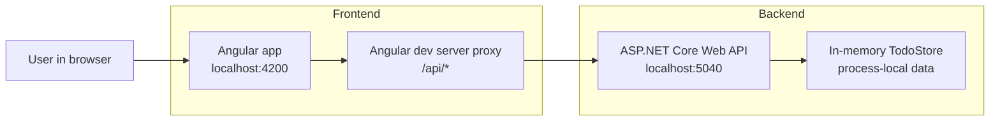

# Architecture

This project keeps the frontend, HTTP API, and storage responsibilities separate while staying small enough for a code test.

## Runtime View



## Boundaries

The Angular app owns browser state, rendering, form input, loading state, and user-visible errors. It calls relative API URLs such as `/api/todos`; it does not know the backend port.

The Angular development server owns the local proxy. During development, it forwards `/api/*` requests from `localhost:4200` to the backend at `localhost:5040`.

The ASP.NET Core API owns the HTTP contract:

- `GET /api/todos` returns the current list.
- `POST /api/todos` creates an item from a non-empty title.
- `DELETE /api/todos/{id}` removes an existing item.

The in-memory store owns process-local TODO state and ID assignment. It is replaceable with a database-backed store if the API contract stays stable.

## Data Flow

Adding a TODO follows this path:

```text
User submits form
→ Angular component trims and validates visible input
→ TodoApiService sends POST /api/todos
→ Angular proxy forwards the request
→ ASP.NET endpoint validates the request body
→ InMemoryTodoStore assigns an ID and stores the item
→ API returns the created item
→ Angular app appends the item to the rendered list
```

Deleting a TODO follows the same boundary in reverse: the component sends `DELETE /api/todos/{id}`, the backend removes the item if present, and the component removes it from the displayed list after a successful response.

## Failure Modes

- If the backend is not running, the frontend shows a load or mutation error.
- If the frontend sends an empty title, the backend returns `400 Bad Request`.
- If a delete request targets an unknown ID, the backend returns `404 Not Found`.
- If the backend process restarts, all TODO items are lost because storage is intentionally in memory.
